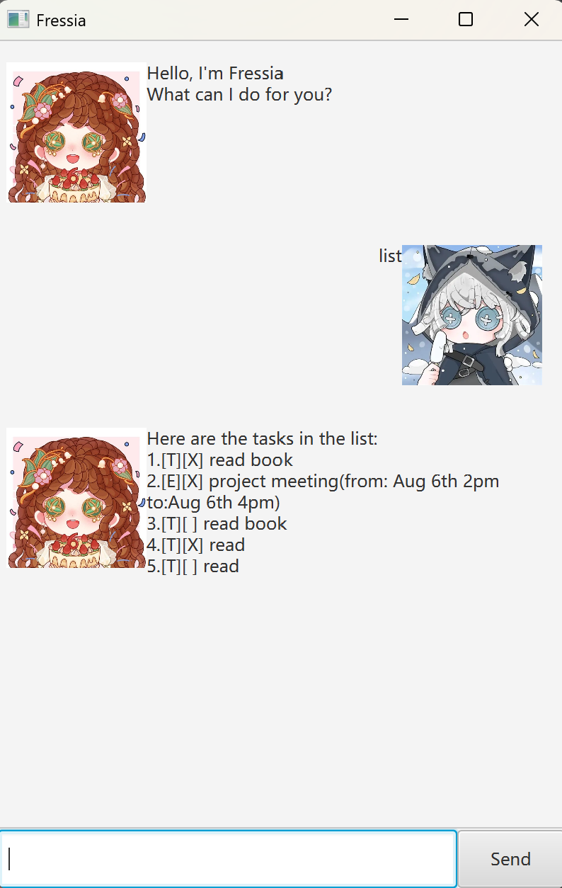
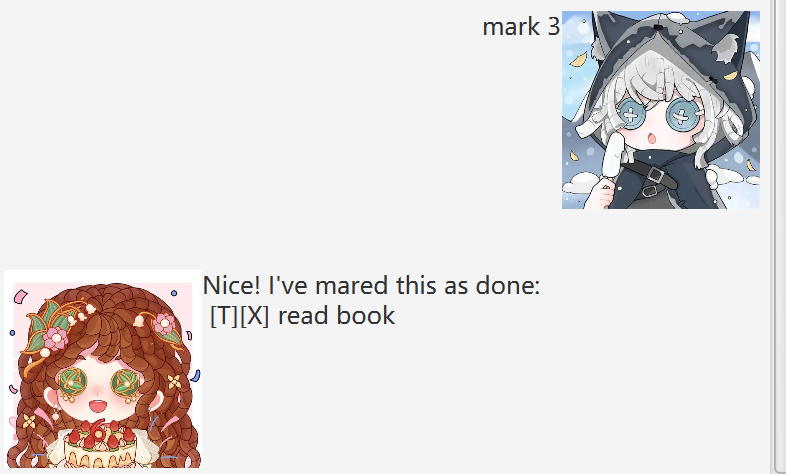
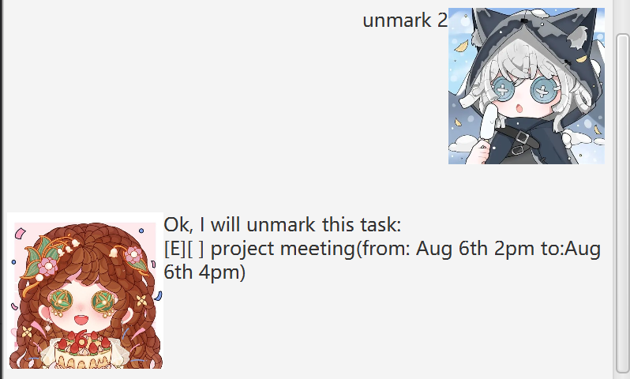
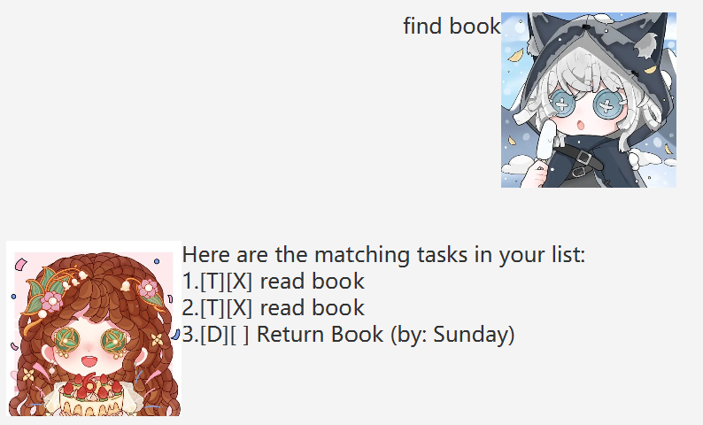

# Fressia User Guide

Fressia is a (Personal Assistant Chatbot)B that helps a peron to keep track of various things.

## Features

### Adding Deadline task: `deadline`

Adds a task with specified description and deadline.

Format : `deadline deacription /by deadline`
Example: `deadline Return Book /by Sunday`

The input deadline task will be added to the list:

### Adding Todo task: `todo`

Adds a task with specified description.

Format : `todo deacription`
Example: `todo Read Book`

The input todo task will be added to the list.

### Adding Event task: `event`

Adds a task with specified description, starting time and ending time.

Format : `event deacription /from startTime /to endTime`
Example: `event Assignment 1 /from 2/03/2026 /to 12/03/2026`

The input event task will be added to the list.

> Tip:\
> If you want to input deadline, startTime or endTime as date, here are available format:
> - yyyy-MM-dd 
> - dd/MM/yyyy 
> - d/MM/yyyy

## Delete a task: `detele`
Deletes the specified task from the list.

Format : `delet INDEX`
- The index refers to the number shown in the displayed task list.
- The index must be a (positive integer).

Example: `delete 2` deletes the 2nd task in the list.

The task will  be removed form the list.

## List all task: `list`
Shows a list of all tasks in the order it was added.

Format: `list`

## Mark a task as done: `mark`
Mark the status of a task as done.

Format: `mark INDEX`
- The index must be a (positive integer).

Example: `mark 3` marks the 3rd task as done.

Task will be marked as done with '[X]' showing in the list.

## Unmark a task: `unmark`
Mark the status of a task as done.

Format: `unmark INDEX`
- The index must be a (positive integer).

Example: `unmark 2` marks the 2nd task as not done.

Task will be marked as done with '[ ]' showing in the list.

>Tip: When a task is added, the default status is 'not done'.

## Find tasks: `find`
Finds tasks with description contain the given keyword.

Format: `find KEYWORD`
- The search is case-insensitive. e.g. `Book` will match `book`

Example: `find book` returns `read book` and `Return Book`

## Saving the data
Fressia data are saved in the hard disk automatically after any command that changes the data. There is no need to save manually.